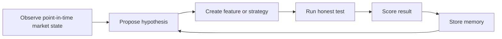
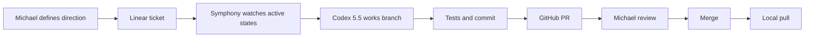

# AI-Native Silver

This document explains the core idea behind Silver after stepping back from the
original "AI analyst" framing.

The important shift is this:

```text
Do not build an AI-assisted Wall Street analyst.
Build an investment learning environment where AI agents can run experiments.
```

Silver should not merely copy a human analyst workflow and make it faster. The
goal is to build a point-in-time market environment where intelligence can
observe, propose, test, fail, remember, and improve.

## Decision Anchor

**Goal:** Determine whether AI-derived signals can improve forward-return
prediction for US equities, net of costs, without cheating through leakage,
overfit, survivorship bias, or vague reasoning.

**User value:** Michael gets a system that can explore investment hypotheses at
machine scale while preserving the rigor, auditability, and skepticism required
for real financial research.

**Constraint:** Silver must remain a falsification machine. "No edge" is a valid
answer. The system is successful if it tells the truth, not if it produces an
exciting backtest.

**Evidence standard:** A claim is not real until it survives point-in-time
replay, baseline comparison, costs, regime splits, label-scramble tests, and
out-of-sample validation.

**Falsifier:** If AI-derived features do not improve over numeric baselines after
these checks, the thesis fails at that scale and the result should be recorded.

## The Mental Model

Silver is best understood as an **investment gym**.

In a normal analyst workflow, a human asks questions like:

```text
Is this company good?
Is the market missing something?
What does the transcript imply?
Should we buy the stock?
```

That is useful, but it carries human constraints:

- limited attention
- limited memory
- narrative bias
- inherited institutional habits
- preference for dashboards and reports
- difficulty testing thousands of small hypotheses

An AI-native system should ask a different question:

```text
What kind of environment would let intelligence discover, test, and improve
investment behavior that a human analyst might never think to try?
```

The result is not a chatbot that gives opinions. It is a learning environment
with observations, actions, rewards, memory, and constraints.

## Core Loop

The central loop is:



The agent should not simply answer a question. It should be able to try an idea,
see whether it worked, learn from the result, and decide what to try next.

Example hypothesis:

```text
Companies with rising transcript uncertainty and weakening 12-1 momentum
underperform over the next 63 trading days.
```

Silver should let the agent:

1. Identify the required features.
2. Confirm those features were available at each historical date.
3. Build the test.
4. Compare against simple baselines.
5. Charge transaction costs.
6. Check whether the result survives different periods.
7. Run label-scramble and robustness tests.
8. Save both the result and the failure mode.
9. Propose the next experiment.

## Is This Supervised Learning?

Partly, yes.

The basic prediction problem is supervised learning:

```text
Input: what was knowable as of date D
Label: realized future excess return over a horizon
Task: predict the label from the input
```

For example:

```text
Given what was knowable about MSFT on 2024-01-10,
predict its 63-trading-day excess return versus SPY.
```

That is a supervised learning problem because the future return becomes the
label after enough time has passed.

But Silver should not be only supervised learning.

The larger system is an agentic research loop:

```text
Observe data -> propose hypothesis -> create feature -> run experiment
-> receive score -> store memory -> choose next experiment
```

That outer loop is closer to reinforcement learning, evolutionary search, or
agentic experimentation. The agent's action is not "buy AAPL immediately." At
first, the agent's action is safer and more research-oriented:

- create this feature
- test this horizon
- compare this baseline
- inspect this failure
- combine these signals
- reject this hypothesis
- try this variant

This avoids the dangerous path of letting an unconstrained reinforcement learner
optimize historical P&L directly. In finance, a naive RL agent will usually find
bugs in the simulator, leakage in the data, or overfit patterns that do not
survive contact with the future.

So the near-term design is:

```text
Use supervised learning for prediction.
Use agentic search for research.
Use backtests and falsifiers as the environment reward.
```

## Why Not Pure Reinforcement Learning First?

Markets are not Go, chess, or Atari.

Those environments have stable rules, clean state, fast simulation, and clear
rewards. Financial markets are different:

- the rules change
- the data is delayed and revised
- the market adapts
- labels are noisy
- transaction costs matter
- many patterns are statistical accidents
- historical simulation can be subtly wrong

If Silver starts with pure RL against a historical market simulator, the system
may learn to exploit weaknesses in the simulator instead of learning a real
investment edge.

The safer path is:

1. Build a strict point-in-time supervised/backtest environment.
2. Force every idea through falsifiers.
3. Let agents search the hypothesis space inside that environment.
4. Only later consider deeper RL-style policy learning.

## The Data Shape

The data must be shaped as an environment, not as a pile of CSV files.

For every security and every as-of date, Silver needs to answer:

```text
What did the world look like to the agent at this moment?
What data was actually knowable?
What features existed?
What prediction was made?
What portfolio would have been held?
What happened later?
Was the prediction useful after costs?
```

This requires layered data.

## Layer 1: Raw Vault

Everything starts as immutable raw data.

Examples:

- FMP price response
- SEC filing HTML
- XBRL companyfacts JSON
- earnings transcript text
- corporate action feed
- news article body

Silver stores:

- the raw response
- source name
- request fingerprint
- content hash
- fetched timestamp
- metadata

The raw vault should be append-only. If a vendor response changes, Silver stores
a new raw object rather than mutating the old one.

Reason:

```text
If an agent later discovers something, we need to know exactly what data it saw.
```

## Layer 2: Point-In-Time Normalization

Raw objects are converted into Silver-native rows with strict time discipline.

The key timestamps are:

| Timestamp | Meaning |
|---|---|
| `event_at` | When the thing happened in the world |
| `published_at` | When the source says it became public |
| `available_at` | When Silver is allowed to use it in simulation |
| `ingested_at` | When Silver fetched or loaded it |
| `asof_date` | The simulated "today" for a prediction or backtest |

The load-bearing rule is:

```text
A backtest at asof_date D may use only data where available_at <= D.
```

This is the main anti-cheating rule. If it breaks, the research is invalid.

## Layer 3: Feature Store

Features are structured signals computed from point-in-time data.

Numeric examples:

- 12-1 momentum
- 30-day volatility
- valuation ratios
- earnings growth
- revision changes
- balance sheet quality

AI/text examples:

- management uncertainty
- demand strength
- pricing power
- competitive pressure
- capital allocation quality
- guidance confidence
- litigation or regulatory pressure

Text features should not remain vague prose. They should become versioned,
structured values.

Example:

```json
{
  "feature": "management_uncertainty",
  "value": 0.73,
  "confidence": 0.82,
  "source": "earnings_call_transcript",
  "model_version": "gpt-5.5",
  "prompt_version": "v1"
}
```

Each feature value must record:

- security
- as-of date
- feature definition
- feature version
- model version, when relevant
- prompt version, when relevant
- available-at policy
- source artifact or source event

No feature should exist without a version and an `available_at` path.

## Layer 4: Labels

Labels are future outcomes.

For each security and label date, Silver computes forward returns after the
horizon has elapsed.

The canonical horizons should be trading-day based:

| Horizon | Meaning |
|---:|---|
| 5 trading days | about 1 week |
| 21 trading days | about 1 month |
| 63 trading days | about 3 months |
| 126 trading days | about 6 months |
| 252 trading days | about 1 year |

The preferred target is excess return, not raw return:

```text
security forward return - benchmark forward return
```

Default benchmark:

```text
SPY for market-relative excess return
```

The reason is simple: predicting raw return often reduces to predicting market
direction. Silver should be asking whether a signal helps select securities
better than the market or a baseline.

Labels must never be visible to a prediction before the horizon has elapsed.

## Layer 5: Experiment Ledger

Every experiment should be recorded, including failures.

The experiment ledger should capture:

- hypothesis
- feature set
- target horizon
- universe
- train window
- test window
- model type
- code git SHA
- random seed
- available-at policy versions
- transaction cost assumptions
- baseline comparison
- metrics
- falsifier results
- critic notes
- next proposed experiments

This is the system's memory.

Without an experiment ledger, agents repeat work, forget failures, and produce
one-off conversations. With a ledger, Silver becomes cumulative.

## The Reward Function

Silver should not reward "made money in one backtest."

That creates an overfitting machine.

The reward should favor results that are:

- out-of-sample
- net of costs
- better than simple baselines
- stable across regimes
- not dependent on one parameter setting
- not dependent on one sector or one year
- robust to label-scramble tests
- reproducible from stored metadata
- simple enough to explain
- still plausible under adversarial review

The reward is therefore a composite score, not just Sharpe.

Example reward ingredients:

```text
positive:
  - out-of-sample information coefficient
  - net Sharpe
  - improvement over numeric baseline
  - consistency across regimes
  - successful reproducibility check

negative:
  - high turnover
  - high drawdown
  - excessive complexity
  - weak capacity
  - sensitivity to one period
  - failed label-scramble test
  - possible leakage
```

The agent should learn that cheap historical tricks are bad and robust,
reproducible signals are good.

## Agent Roles

Silver can eventually use multiple agent roles.

### Builder Agent

Builds code, migrations, tests, and tools through Symphony/Codex.

Near-term example:

```text
Create the available-at policy seed file and tests.
```

### Research Agent

Proposes hypotheses and feature ideas.

Example:

```text
Find whether transcript uncertainty predicts 63-day excess returns after
controlling for momentum and volatility.
```

### Critic Agent

Tries to break the research.

Example attacks:

- Is this using future data?
- Is the universe survivorship-biased?
- Did this only work in 2020?
- Is the signal just sector exposure?
- Does it survive label scrambling?
- Is the feature too expensive to compute?

### Validator Agent

Runs the required test gate and decides whether the result is admissible.

The validator does not decide whether something is exciting. It decides whether
the result is allowed to be believed.

### Human Governor

Michael controls the lab:

- which data is allowed
- which risks are unacceptable
- which tickets get activated
- which strategies may advance
- whether anything moves from simulation to paper trading
- whether paper trading ever becomes live capital

The AI gets freedom inside the environment. The human governs the environment.

## How Symphony Fits

Symphony is not the investment brain.

Symphony is the construction and orchestration system that lets agents build the
environment safely through small tickets.

The flow is:



Symphony is useful because it creates a repeatable build loop:

- one bounded task
- one branch
- one implementation
- one test set
- one PR
- one review

That is how we construct the investment gym without letting the architecture
sprawl.

## Build Sequence

The build should proceed from environment correctness to agent freedom.

Do not start with fancy AI features. Start with a tiny market world that cannot
cheat.

### Silver Gym v0

Minimum useful environment:

1. Available-at policies.
2. Securities table.
3. Trading calendar.
4. Tiny falsifier universe.
5. Daily adjusted prices.
6. Corporate actions.
7. Forward-return labels.
8. 12-1 momentum baseline.
9. Experiment runner.
10. Backtest result ledger.
11. Label-scramble falsifier.
12. Reproducible command that runs end to end.

The first real target command should look like:

```bash
python scripts/run_falsifier.py --strategy momentum_12_1 --horizon 63 --universe falsifier_seed
```

The purpose of this first loop is not to discover alpha. It is to prove the gym
can run a known simple baseline honestly.

### Phase 1: Environment Integrity

Goal:

```text
Silver can persist point-in-time data and reproduce a simple baseline.
```

Build:

- available-at policies
- seed universe
- trading calendar
- daily price ingest
- forward labels
- one baseline feature
- one falsifier command

### Phase 2: Trustworthy Backtests

Goal:

```text
Every backtest result is reproducible and adversarially checked.
```

Build:

- model runs
- backtest runs
- prediction rows
- outcome rows
- transaction costs
- regime splits
- label-scramble tests
- baseline comparison
- result replay from `model_run_id`

### Phase 3: Numeric Baselines

Goal:

```text
Create strong non-AI baselines before claiming AI improves anything.
```

Build:

- deterministic numeric features
- linear models
- simple tree models if needed
- numeric ensemble
- per-horizon scorecards

No AI text result is meaningful until it beats this layer.

### Phase 4: AI Text Features

Goal:

```text
Convert unstructured text into immutable, versioned numeric features.
```

Build:

- transcript ingest
- filing ingest
- prompt versioning
- model versioning
- feature extraction cache
- confidence scores
- repeatability checks

The LLM extracts features. It does not score its own investment merit.

### Phase 5: Agentic Research Loop

Goal:

```text
Agents propose, critics attack, validators test, and the ledger remembers.
```

Build:

- hypothesis schema
- research agent action API
- critic agent prompts/tools
- validator gate
- experiment memory
- next-experiment suggestions

This is where Silver starts to feel meaningfully AI-native.

### Phase 6: Paper Trading

Goal:

```text
Validated hypotheses face the future without capital risk.
```

Build:

- daily prediction job
- paper portfolio
- drift monitoring
- drawdown halt
- capacity estimates
- comparison against backtest expectation

Live capital remains out of scope until paper trading survives for a meaningful
period.

## How Data Gets Into the System

The ingestion path should be boring and strict.

### Step 1: Source Selection

Start with sources already allowed by `SPEC.md`:

- FMP for prices, fundamentals, transcripts, and corporate actions
- SEC EDGAR for filings and XBRL facts
- optional local raw vendor-byte cache for bootstrap speed
- optional Norgate later for delisting history

Do not begin with too many data vendors. More vendors increase surface area for
timestamp bugs and normalization mistakes.

### Step 2: Raw Capture

Each fetch writes to `silver.raw_objects`.

The raw object records:

- source
- endpoint
- request parameters
- response body
- content hash
- fetched_at
- status

This creates a vendor-byte audit trail.

### Step 3: Normalize With Available-At

Adapters convert raw objects into typed Silver rows:

- `prices_daily`
- `corporate_actions`
- `events`
- `artifacts`
- `fundamental_facts`

Every normalized row must have an `available_at` rule.

### Step 4: Compute Features

Feature code reads normalized data and writes immutable feature values.

Feature computations must be:

- versioned
- deterministic where possible
- tied to source data
- tied to an as-of date
- blocked if required data is missing

### Step 5: Compute Labels

Labels are computed from future prices only after the forward horizon exists.

For example, a 63-trading-day label for 2024-01-10 can be written only after the
63rd later trading day is available.

### Step 6: Run Experiments

Experiments read feature snapshots and labels, then write results.

The agent does not manually inspect raw data and declare a conclusion. It uses
the experiment engine.

## Example End-to-End Experiment

Hypothesis:

```text
High transcript uncertainty predicts underperformance over 63 trading days,
especially when price momentum is already weak.
```

Silver execution:

1. Pull universe members as of each date.
2. Pull transcript artifacts where `available_at <= asof_date`.
3. Use a versioned LLM prompt to extract `management_uncertainty`.
4. Compute 12-1 momentum from price data available as of that date.
5. Create a frozen feature snapshot.
6. Train only on past labels.
7. Predict 63-trading-day excess returns.
8. Construct simulated long/short or ranked portfolio.
9. Charge costs.
10. Compare against momentum-only and numeric-only baselines.
11. Run label-scramble.
12. Break results by regime and sector.
13. Store experiment results and critic notes.
14. Propose next test.

The final output is not just:

```text
Sharpe = 1.2
```

The final output is:

```text
This hypothesis improved 63-day excess-return prediction by X over baseline,
net of costs, across these regimes, with these failure modes, under this exact
code and data version.
```

## What We Should Not Build Yet

To keep the system from becoming an AI-themed version of a traditional research
desk, defer:

- analyst dashboards
- manual override flows
- stock pitch generation
- valuation writeups
- portfolio reporting UI
- broad data-vendor integrations
- live trading
- unconstrained RL trading agents
- free-form LLM access to labels and outcomes

These may be useful later, but they should not define the foundation.

The foundation is the learning environment.

## Key Principle

Silver should let intelligence explore freely only after the environment makes
cheating hard.

That means the order is:

```text
1. Time discipline
2. Data integrity
3. Reproducible baselines
4. Honest falsifiers
5. AI text features
6. Agentic hypothesis search
7. Paper trading
8. Possible live deployment
```

This is the AI-native version of the project.

The human process is not the template. The environment is the template.

## Near-Term Ticket Direction

The next tickets should build Silver Gym v0:

1. Seed `available_at_policies`.
2. Seed initial securities and falsifier universe.
3. Add trading calendar.
4. Add raw vault writer.
5. Add FMP daily prices ingest for the falsifier seed universe.
6. Compute 5, 21, 63, 126, and 252 trading-day labels.
7. Compute 12-1 momentum.
8. Add first falsifier command.
9. Add experiment ledger.

Only after this should we create AI text feature tickets.

## Source Inspirations

This direction is inspired by, but not dependent on, recent AI-native systems
thinking:

- David Silver's reinforcement-learning work and the reported
  [Ineffable Intelligence](https://techcrunch.com/2026/04/27/deepminds-david-silver-just-raised-1-1b-to-build-an-ai-that-learns-without-human-data/)
  "superlearner" direction: learning through interaction and trial rather than
  copying human data.
- Block's [Goose agent framework](https://block.github.io/goose/blog/2025/01/28/introducing-codename-goose):
  agents as workers that can execute real tasks through tools, rather than
  copilots that merely suggest text.
- OpenAI's [Harness Engineering](https://openai.com/index/harness-engineering/)
  and [Symphony](https://openai.com/index/open-source-codex-orchestration-symphony/)
  patterns: agents need structured environments, constraints, review loops, and
  reproducible handoffs.

Silver applies those ideas to investment research by turning the market data
stack into a controlled learning environment.
